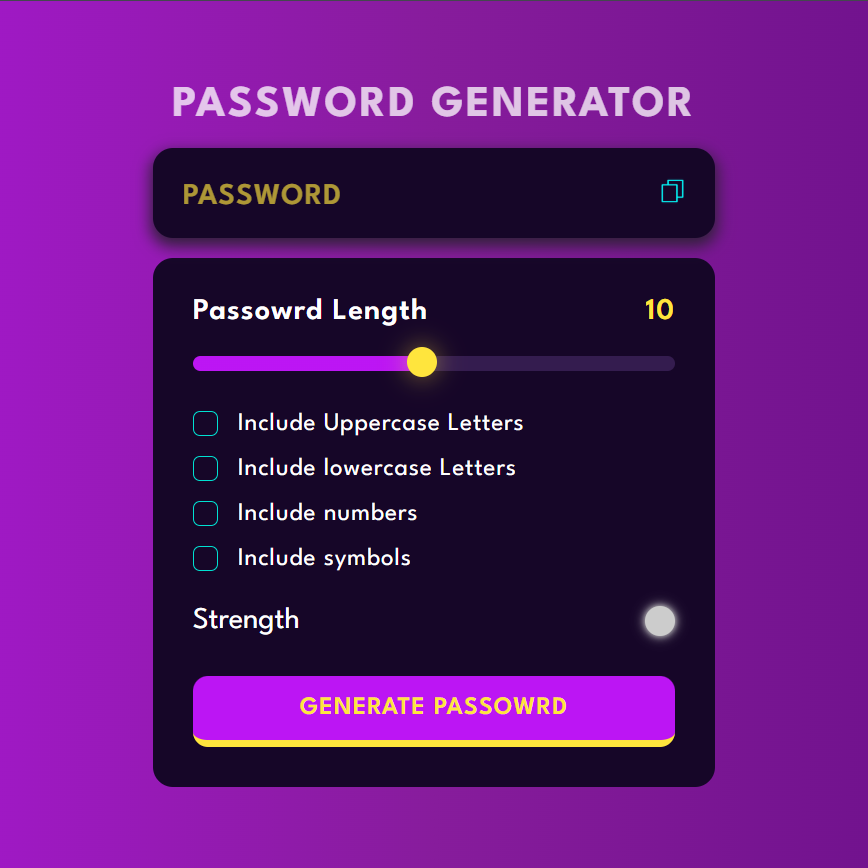
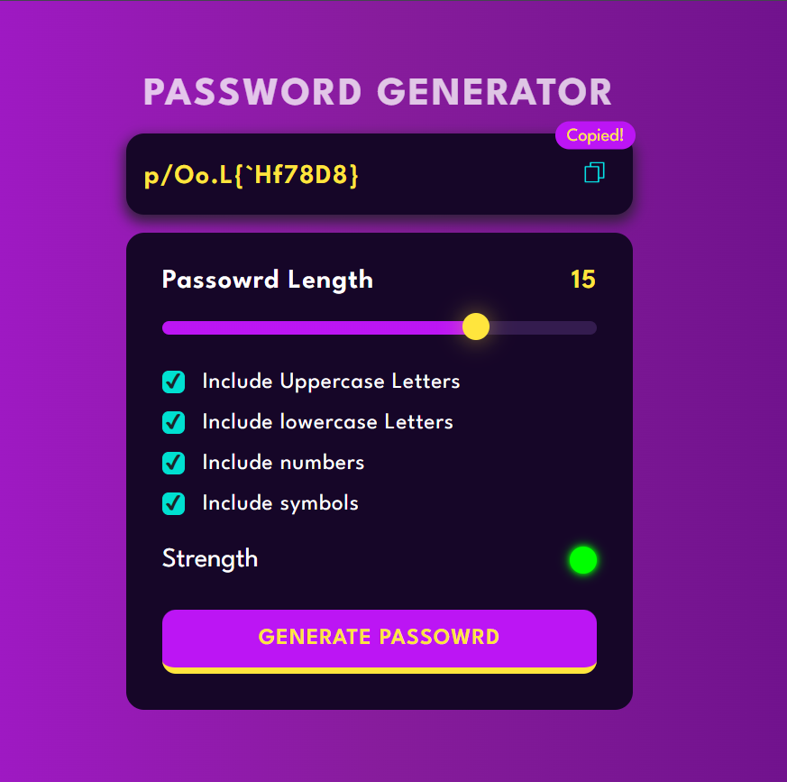

# 🔐 Password Generator

## 📖 Table of Contents
- [Overview](#-overview)
- [Screenshot](#-screenshot)
- [Features](#-features)
- [Tech Stack](#%EF%B8%8F-tech-stack)
- [Usage Instructions](#-usage-instructions)
- [License](#-license)

## 🌟 Overview
The **Password Generator** is a web application that allows users to generate secure passwords based on customizable criteria. Users can specify the length of the password and choose to include uppercase letters, lowercase letters, numbers, and symbols. The application provides a user-friendly interface and visual indicators for password strength.

## 🔍 Screenshot
&nbsp;&nbsp;&nbsp;&nbsp;

## ✨ Features
- 🔢 Generate passwords of customizable lengths (1 to 20 characters).
- 🔠 Options to include uppercase letters, lowercase letters, numbers, and symbols.
- 🛡️ Visual strength indicator to assess password strength.
- 📋 Copy generated password to clipboard with a single click.
- 📱 Responsive design for optimal viewing on various devices.

## 🛠️ Tech Stack
- 🌐 **HTML5**: For structuring the web page.
- 🎨 **CSS3**: For styling and responsive design.
- ⚙️ **JavaScript**: For dynamic functionality and interactivity.

## 🚀 Usage Instructions
1. Clone the repository to your local machine using:
   ```bash
   git clone https://github.com/AlokKumarYadav2410/password-generator.git
   ```
2. Navigate to the project directory:
   ```bash
   cd password-generator
   ```
3. Open `index.html` in your web browser to start using the Password Generator.
4. Adjust the password length using the slider and select your desired options.
5. Click the "Generate Password" button to create a password.
6. Use the copy button to copy the generated password to your clipboard.

## 📜 License
This project is licensed under the **MIT License**. See the [LICENSE](LICENSE) file for details.

---

🎉 **Enjoy generating secure passwords with ease!**
